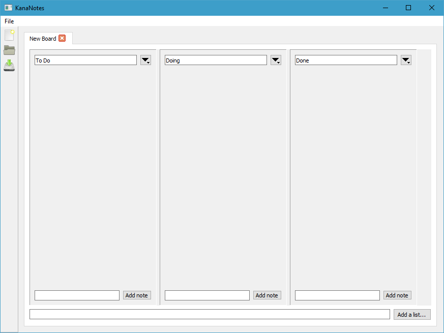
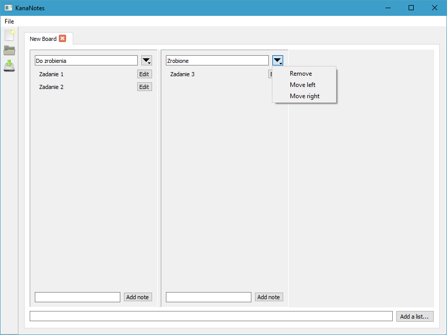
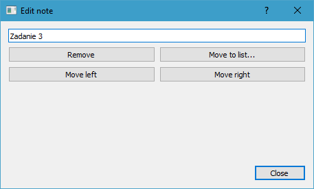

# KanaNotes

Projekt zaliczeniowy z "Programowania obiektowego".

Jest to prosta aplikacja do tworzenia notatek metodą [kanban]. Została ona napisana z wykorzystaniem technologii [Qt] w programie QtCreator.

# Zdjęcia

[kanban]: https://pl.wikipedia.org/wiki/Kanban
[Qt]: https://www.qt.io/